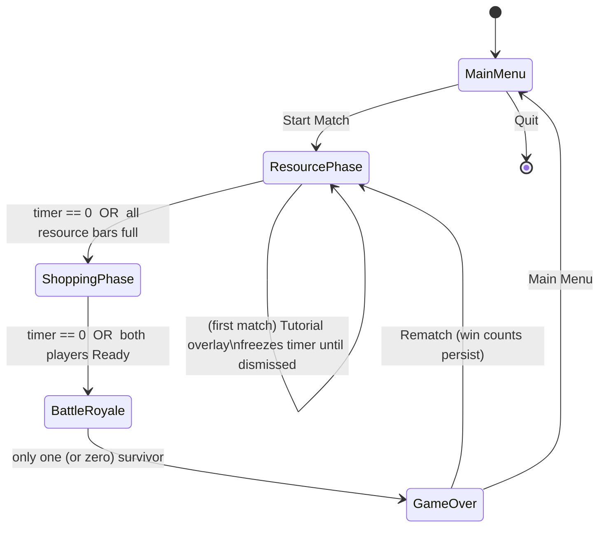
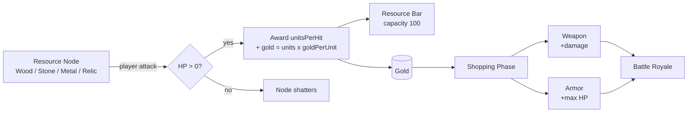

# ArenaCraft — Analysis Models (GDD Appendix B)

These are the diagrams the GDD lists as "to be added". They document the
implemented architecture.

## B.1 Game State Machine



Implemented by `GameManager.Phase` (`Core/GamePhase.cs`) and the per-phase logic
in `GameManager.Update`.

## B.2 Economy Flow



Implemented by `ResourceNode.TakeDamage` → `PlayerStats.CollectResource`
(auto-conversion to gold) and `PlayerStats.TryBuy`.

## B.3 Component Overview

```
GameBootstrap (scene entry, builds everything)
 ├── AudioManager        procedural SFX + calm/battle music
 ├── UIManager           Canvas + HUD + Menu/Options/Tutorial/Shop/Victory
 │    ├── PlayerHUD x2    HP / resource / gold / equipment
 │    ├── ShopPanel x2    per-player keyboard shopping
 │    └── MenuNavigator   keyboard navigation for full-screen menus
 ├── ArenaCamera         orthographic 2.5D framing
 └── GameManager  ───────── owns the match
      ├── GameSettings              all tunable balance values
      ├── ArenaBuilder              colosseum floor / walls / torches
      ├── ResourceNodeSpawner ──► ResourceNode (IDamageable)
      ├── PlayerFactory       ──► PlayerController (IDamageable) + PlayerStats
      └── ShopCatalog         ──► ShopItem
```

`IDamageable` (`Combat/IDamageable.cs`) is the shared contract that lets the same
melee swing damage both resource nodes and opposing players.
